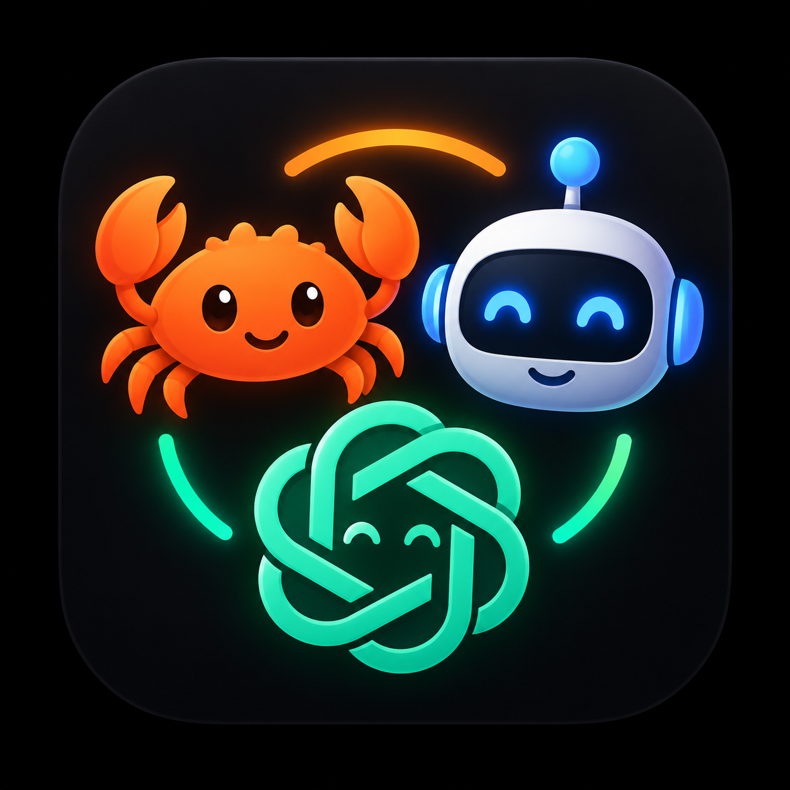

<p align="center">
  
</p>

<h1 align="center">AgentHub</h1>

<p align="center">
  A Windows desktop control centre for your GitHub repositories and the AI coding CLIs you run in them.
</p>

<p align="center">
  <a href="https://github.com/Daznl/AgentHub/actions/workflows/build.yml"></a>
  
  
  <a href="LICENSE"></a>
</p>

---

AgentHub treats the **repository as the workspace** and the AI CLI as an **interchangeable tool**. Register or clone a repo once, see its Git state at a glance, pull and push with one click, then launch Codex, Claude Code or Google Antigravity in that exact working directory, either in Windows Terminal or inside AgentHub's own multi-pane terminal cockpit.

It never stores API keys or provider credentials. Authentication stays with the tools you already use: each coding CLI, the GitHub CLI and Git Credential Manager.

## Contents

- [Features](#features)
- [Requirements](#requirements)
- [Getting started](#getting-started)
- [Configuration](#configuration)
- [GitHub accounts and permissions](#github-accounts-and-permissions)
- [Usage limit cards](#usage-limit-cards)
- [Handoff convention](#handoff-convention)
- [Safety choices](#safety-choices)
- [Project layout](#project-layout)
- [Development](#development)
- [Roadmap](#roadmap)
- [License](#license)

## Features

### Local repositories

- Register existing Git clones or clone new ones by HTTPS or SSH URL.
- **Scan folder for repos** searches a chosen folder two levels deep, finds every Git clone and links each one to its GitHub remote.
- Colour-coded sync badges: `✓ Up to date`, `⇣ Behind`, `⇡ Ahead`, `✎ Modified`.
- Inspector shows current branch, changed-file count, ahead/behind counts and the origin remote.
- One-click `git fetch --prune`, fast-forward `git pull` and `git push`.
- Open the repository folder in Explorer or the remote on GitHub.

### GitHub repository browser

- Sign in to GitHub from inside the app. AgentHub drives `gh auth login --web`, shows the one-time code and opens the browser. The GitHub CLI keeps the token.
- Sign in to several accounts and switch between them from a dropdown. GitHub Enterprise Server hosts are supported.
- Lists every repository the active account can see: your own, shared with you and every organisation you belong to. Results stream in page by page.
- Repos are grouped by what GitHub says you may do: your own, organisation repos you can push to, organisation repos you can only clone or pull, and archived.
- Each card shows the owner and your role (Admin, Maintain, Push or Read-only). The Push button appears only where GitHub will accept a push.
- Filter by access, visibility or sync status. Clone and register any visible repo with one click.

### Terminal cockpit

- Run up to six interactive sessions side by side inside AgentHub, powered by Windows ConPTY and xterm.js in WebView2.
- Each pane can host Codex, Claude Code, Antigravity, PowerShell or Cmd, in any registered repository or any folder you pick.
- Draggable splitters, **➕ Add Terminal**, per-pane close buttons and clean session teardown.
- **Working and waiting indicators.** A pane running a coding CLI breathes blue while the CLI is producing output. When the CLI goes quiet, or rings the terminal bell, the pane pulses amber with a **⏳ WAITING FOR YOU** badge until you type. If AgentHub is in the background, the taskbar button flashes. Plain shells are never tracked.
- Launch an agent into a specific pane straight from a repository card, or into a new Windows Terminal tab.

### Usage limit cards

- Live 5-hour and weekly quota for Codex, Claude Code and Antigravity, shown above the terminals.
- Each card shows percentage left, reset time, the data source and refresh state. Cards can be hidden individually and reopened from chips.
- Polled on a configurable interval. See [Usage limit cards](#usage-limit-cards) for where the numbers come from.

## Requirements

### To run AgentHub

| Requirement | Why | Notes |
|---|---|---|
| **Windows 10 version 1809 or later, or Windows 11** | The embedded terminal uses the Windows Pseudo Console (ConPTY) API, which first shipped in 1809. | 64-bit. |
| **.NET 8 Desktop Runtime** | AgentHub is a .NET 8 WPF application. | Included in the .NET 8 SDK. If you only run a published build, install the [.NET 8 Desktop Runtime](https://dotnet.microsoft.com/download/dotnet/8.0). |
| **Microsoft Edge WebView2 Runtime** | Terminal panes render xterm.js inside WebView2. | Preinstalled on Windows 11 and most up-to-date Windows 10 machines. Otherwise install the [Evergreen runtime](https://developer.microsoft.com/microsoft-edge/webview2/). |
| **Git** on `PATH` | All repository operations shell out to `git`. | [git-scm.com](https://git-scm.com/download/win). Git Credential Manager, bundled with Git for Windows, handles push authentication. |

### To build from source

| Requirement | Notes |
|---|---|
| **.NET 8 SDK** | [dotnet.microsoft.com](https://dotnet.microsoft.com/download/dotnet/8.0). Check with `dotnet --version`. |

No IDE is required. Visual Studio 2022 or Rider open `AgentHub.sln` if you prefer one.

### Optional, but this is what makes it useful

| Tool | Command | Used for |
|---|---|---|
| [GitHub CLI](https://cli.github.com/) | `gh` | Sign-in, account switching and the repository browser. Without it the GitHub view is unavailable. Local repos still work. |
| [Windows Terminal](https://aka.ms/terminal) | `wt.exe` | External tabbed launches. Falls back to a plain PowerShell window when absent. |
| [OpenAI Codex CLI](https://github.com/openai/codex) | `codex` | Agent launches and the Codex usage card. |
| [Claude Code](https://docs.anthropic.com/en/docs/claude-code) | `claude` | Agent launches and the Claude usage card. |
| Google Antigravity CLI | `agy` | Agent launches and the Antigravity usage card. |

Every CLI must be on `PATH` and already signed in through its own login flow. AgentHub does not manage provider authentication.

The bootstrap script reports which of these it found before it builds.

## Getting started

### Fastest path

Clone the repo and run the bootstrap script from the repository root. It checks prerequisites, restores and builds the solution, then launches the app.

```cmd
git clone https://github.com/Daznl/AgentHub.git
cd AgentHub
.\bootstrap.cmd
```

### Build and run manually

```powershell
dotnet restore .\AgentHub.sln
dotnet run --project .\src\AgentHub\AgentHub.csproj
```

### Release build

Produces a branded `AgentHub.exe` with its icon on the shortcut and taskbar. This build is framework-dependent, so the target machine needs the .NET 8 Desktop Runtime.

```powershell
dotnet publish .\src\AgentHub\AgentHub.csproj -c Release -r win-x64 --self-contained false
```

The executable is written to:

```text
src\AgentHub\bin\Release\net8.0-windows\win-x64\publish\AgentHub.exe
```

Right-click it and choose **Pin to taskbar**, or **Send to → Desktop** to create a shortcut.

### First launch

1. Open **Manage GitHub Repos → GitHub Repos** and click **Sign in**, or skip this and add local repos by path.
2. Use **Scan folder for repos** to pull in every clone under your projects folder.
3. Open **⚡ Cockpit**, pick a repo and a shell for a pane, and start working.

## Configuration

AgentHub keeps all settings in a single JSON file, created on first launch:

```text
%APPDATA%\AgentHub\settings.json
```

Defaults:

```json
{
  "agents": [
    { "id": "codex", "name": "Codex", "command": "codex", "arguments": "", "enabled": true },
    { "id": "claude", "name": "Claude Code", "command": "claude", "arguments": "", "enabled": true },
    { "id": "antigravity", "name": "Antigravity", "command": "agy", "arguments": "", "enabled": true }
  ],
  "usageProviders": [
    { "id": "gemini", "name": "Antigravity", "command": "agy", "arguments": ["-p", "/usage"], "enabled": true },
    { "id": "codex", "name": "Codex", "command": "codex", "arguments": ["/status"], "enabled": true, "unqualifiedPercentagesAreRemaining": true },
    { "id": "claude", "name": "Claude Code", "command": "claude", "arguments": ["/status"], "enabled": true }
  ],
  "usageRefreshMinutes": 2,
  "preferWindowsTerminal": true,
  "animatedBackground": true,
  "showUsagePanel": true,
  "hiddenUsageCards": [],
  "attentionFlashEnabled": true,
  "attentionIdleSeconds": 3
}
```

| Setting | What it does |
|---|---|
| `agents` | The CLIs offered in launch menus and pane shell pickers. Add entries to register another tool, or a second profile of an existing one with different `arguments`. Set `enabled` to `false` to hide one. |
| `usageProviders` | Which usage cards appear. Set `enabled` to `false` to drop a provider entirely. |
| `usageRefreshMinutes` | How often usage cards refresh. |
| `preferWindowsTerminal` | Launch external sessions in Windows Terminal when `wt.exe` is available. |
| `animatedBackground` | Drifting glow, scrolling grid and scan sweep behind the main window. Set to `false` for a static backdrop on Remote Desktop, battery or reduced-motion setups. |
| `showUsagePanel` | Whether the usage section above the terminals is visible. Toggled by the **📊 Usage** header button. |
| `hiddenUsageCards` | Provider ids whose card you have closed. Reopen from the chips beside "Usage limits". |
| `attentionFlashEnabled` | Enable the waiting-for-you pane and taskbar alert. |
| `attentionIdleSeconds` | Seconds of silence after a burst of agent output before a pane counts as waiting. |
| `lastTerminalFolder`, `lastScanFolder` | Remembered folder-picker locations. Written automatically. |

A pane is considered waiting when its coding CLI produced at least 1.5 seconds of continuous output after your last keystroke and has then been silent for `attentionIdleSeconds`, or when it rings the bell. Output within 0.75 seconds of a keystroke is treated as echo of your own typing.

If you want an agent profile that skips permission prompts, add a second agent definition with the relevant flag in `arguments` rather than editing the default.

## GitHub accounts and permissions

The header of the GitHub Repos view shows the active GitHub CLI account.

- **Sign in** runs `gh auth login --web`, shows and copies the one-time code and opens github.com. Approve in the browser and `gh` stores the token. Signing in again with a different account adds it alongside the first.
- **Account dropdown** lists every account `gh` knows about. Picking one runs `gh auth switch` and reloads the list. **Sign out** runs `gh auth logout` for the selected account after confirmation.
- **What you see** is every repository the active account can access.
- **What you can do** is decided by GitHub, not AgentHub. Admin, Maintain and Write roles can push. Read and Triage can clone and pull only. Archived repositories are never pushable.
- **Git credentials are separate.** Switching the active `gh` account does not change what `git push` uses. Run `gh auth setup-git` once if you want Git to follow the active `gh` account.

Design notes and gotchas: [docs/GITHUB_INTEGRATION.md](docs/GITHUB_INTEGRATION.md).

## Usage limit cards

AgentHub reads each provider from its cleanest local source rather than scraping an interactive terminal. Every card names its source so you know how much to trust it.

| Provider | Source | Requires |
|---|---|---|
| **Codex** | The `rate_limits` object Codex writes into its session logs under `~/.codex/sessions`. | A Codex session that has made at least one request. |
| **Claude Code** | Anthropic's OAuth usage endpoint, the same one the `/status` screen uses, authenticated with the token Claude Code stores in `~/.claude/.credentials.json`. Calls are throttled to at most one per minute and the last good reading is cached. | Being signed in to Claude Code. |
| **Antigravity** | The output of `agy -p /usage`, which prints limits non-interactively. | `agy` on `PATH` and signed in. |

Nothing is sent anywhere other than the provider's own endpoint, and no credentials are copied or stored by AgentHub.

## Handoff convention

Each repository can contain a plain Markdown file for passing context between agents:

```text
.agenthub/
  handoff.md
```

Before switching agents, record the current task, completed work, next steps and relevant files. Because it is plain Markdown, every CLI can read it without AgentHub being present. This repository's own [`.agenthub/handoff.md`](.agenthub/handoff.md) is an example.

## Safety choices

- Pull uses `--ff-only`. AgentHub never silently creates a merge commit.
- The app does not auto-commit or auto-push.
- Removing a repository from AgentHub does **not** delete local files or the GitHub repository.
- AgentHub never replaces a running cockpit session without asking. New work goes to a new or idle pane.
- Agent permission and autonomy settings remain controlled by the provider CLI.
- Push and pull rights come from GitHub's own permission data, never inferred from ownership or naming.

## Project layout

```text
AgentHub.sln
bootstrap.cmd / bootstrap.ps1     prerequisite check, build and launch
src/AgentHub/                     WPF application
  Models/                         settings, repository, account and usage models
  Services/                       Git, GitHub CLI, discovery, settings and agent launching
  Services/Usage/                 per-provider usage readers and the output parser
  Terminal/                       ConPTY host, xterm.js assets and the terminal controls
  Sessions/                       interfaces for the planned session layer
tests/AgentHub.Tests/             xUnit tests
docs/                             architecture, GitHub integration, cockpit design, roadmap
.github/workflows/build.yml       CI: restore and Release build on windows-latest
```

## Development

Build and test from the repository root:

```powershell
dotnet build .\AgentHub.sln
dotnet test .\AgentHub.sln
```

Notes for contributors:

- The project enables both WPF and Windows Forms, the latter for the native folder picker. Files that touch UI types alias them explicitly, for example `using MessageBox = System.Windows.MessageBox;`.
- Close any running `AgentHub.exe` before building, or the build fails on a locked file.
- Exercise Git command paths with spaces in repository paths before finishing a change.
- Engineering rules for both people and coding agents working on this repo live in [`AGENTS.md`](AGENTS.md).

Further reading:

- [docs/ARCHITECTURE.md](docs/ARCHITECTURE.md), the core rule and current components
- [docs/MULTI_SESSION_COCKPIT.md](docs/MULTI_SESSION_COCKPIT.md), terminal cockpit design and staging plan
- [docs/GITHUB_INTEGRATION.md](docs/GITHUB_INTEGRATION.md), accounts, sign-in and the access-aware browser
- [docs/AGENTIC_SESSION_LAYER.md](docs/AGENTIC_SESSION_LAYER.md), draft design for the session layer

## Roadmap

AgentHub is at an early, working stage. The next major steps are **task worktrees** so parallel agents never share a working tree, followed by a fuller **session manager** and a **usage and budget dashboard**. See [docs/ROADMAP.md](docs/ROADMAP.md) for the milestone plan.

Issues and pull requests are welcome.

## License

[MIT](LICENSE)
